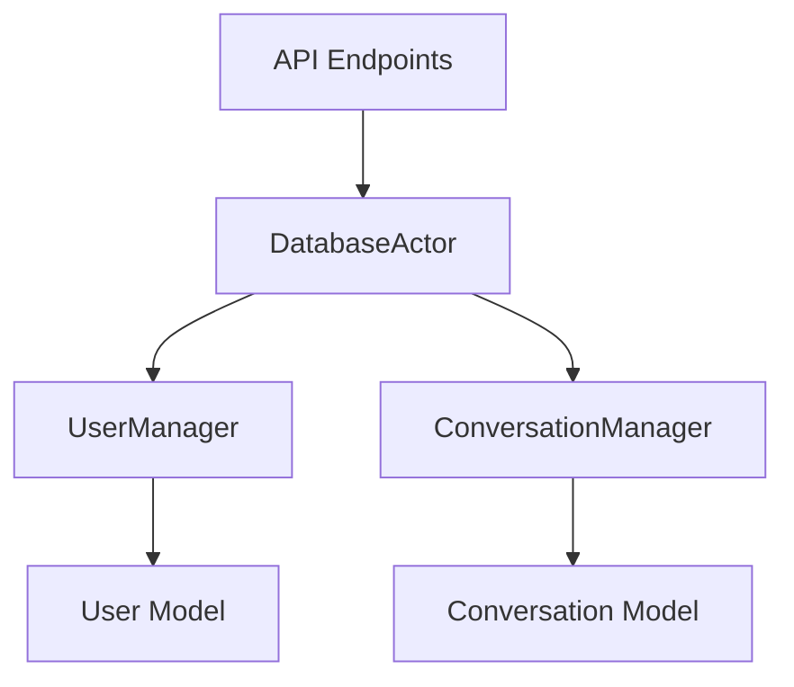
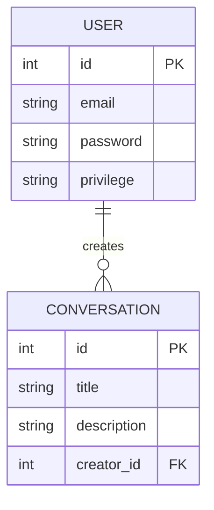

# LitePolis Router Example with Database Integration

This repository demonstrates how to create a LitePolis router module with database integration, using the `litepolis-database-example` package.



## Features

- **Database Integration**: Seamless connection to SQLite database
- **CRUD Operations**: Full user and conversation management
- **Ready-to-use API**: Pre-configured FastAPI endpoints
- **Testing**: Complete test coverage

## Getting Started

1. **Install dependencies**:
```bash
pip install -e .
```

2. **Run the API**:
```bash
uvicorn litepolis_router_example.core:router --reload
```

## API Endpoints

### Users

**Create User**:
```bash
curl -X POST "http://localhost:8000/api/example/users/" \
  -H "Content-Type: application/json" \
  -d '{"email":"user@example.com","password":"password123","privilege":"user"}'
```

**List Users**:
```bash
curl "http://localhost:8000/api/example/users/"
```

### Conversations

**Create Conversation**:
```bash
curl -X POST "http://localhost:8000/api/example/conversations/" \
  -H "Content-Type: application/json" \
  -d '{"title":"Discussion","description":"Test conversation","creator_id":1}'
```

**List Conversations**:
```bash
curl "http://localhost:8000/api/example/conversations/"
```

## Database Schema



## Development

1. **Run tests**:
```bash
pytest -v
```

2. **Code structure**:
```
litepolis_router_example/
├── core.py          # Main router logic
tests/
├── test_core.py     # API tests
```

## Deployment

1. Build the package:
```bash
python setup.py sdist bdist_wheel
```

2. Install in LitePolis environment
